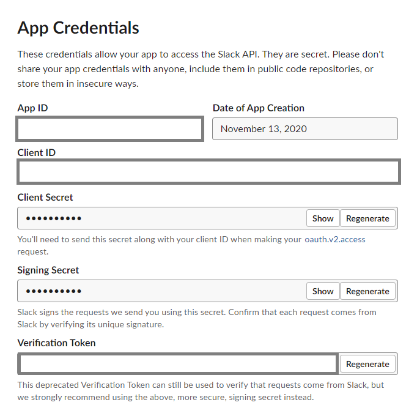

# WikiBot

Access Wikipedia content directly from [Slack](https://slack.com) with [slash](https://api.slack.com/interactivity/slash-commands) commands

<a href="https://slack.com/oauth/v2/authorize?scope=incoming-webhook,commands+team%3Aread&client_id=1493328096710.1500274749571"></a>

## Usage


## Deploying and Development
### Slack 

1. Create your Account at [Slack](https://slack.com/get-started#/create), if you don't already have one.

2. Create your App at [Slack App Creation](https://api.slack.com/apps/new).

   

   Give a name to your app. Select the Workspace where you to install the app to.

3. Once your Application is created, Click on the Basic Information Page and scroll down to find App Credentials section.

   

    Copy the values of **Client ID**, **Client Secret** and **Signing Secret** and store these values in environment variables. Open the shell of your choice and enter,

    ```
   $ export CLIENT_ID="<enter your client id>"
   $ export CLIENT_SECRET="<enter your client secret>"
   $ export SLACK_SIGNING_SECRET="<enter your signing secret>"
   ```

4. Click on "Incoming Webhooks" Page and slide the toggle of "Activate Incoming Webhooks". Once it is toggled, click on "Add New Webhook to Workspace" button in th end

   

4. Now, Slack will ask to authorize the access to your workspace. Select any channel from the dropdown box and click "Allow"

   

### Deploying to Heroku

Now that we have setup our Slack App, it is time for us to deploy our Application. 

Slack will send a request to the Public URL that we've configured in Slash Commands. So, if we are to develop locally, I would suggest you to go with [ngrok](https://ngrok.com/). Ngrok will provide a secure URL to our localhost server through NAT. Please read [Using ngrok to develop locally for Slack](http://api.slack.com/tutorials/tunneling-with-ngrok) for setting up your application to run locally.
 
[](https://heroku.com/deploy?template=https://github.com/vforviswa/wikibot)

We'll be using [Heroku's](https://www.heroku.com/) platform to deploy the Application
1. Create a free account, if you already don't have one.
2. Click on the button below which will automatically take you to the Heroku's Page.
3. Enter a name for your App and fill the Config Vars that we got from above.


### Configuring Slash Commands
The final step is to configure the slash commands
1. Click on "Slash Commands" Page and click **"Create New Command"** button


2. Refer [Slash Commands](#Usage) for list of supported commands

3. The Request URL will be the URL of your deployed application. If you used Heroku, it'll be something like `https://app-name.herokuapp.com`. If you are using ngrok, it'll be something like `http://39ade6ce6764.ngrok.io`


4. Save the Command that you just created.

## Updating Heroku Deployment

1. Login to Heroku and go to your apps' page. 
2. Click on Deploy Tab and follow the instructions to deploy the changes to Heroku.